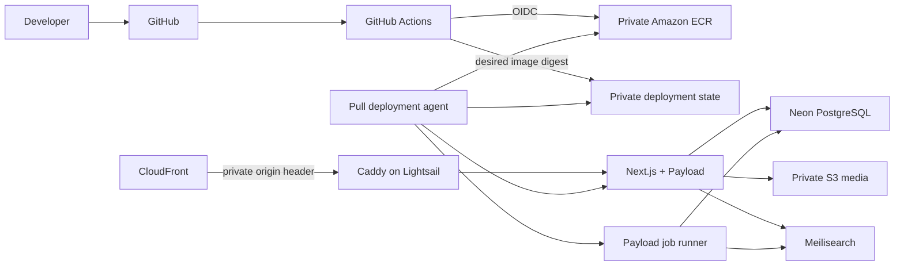

# MMDC Website Foundation and Lightsail Delivery Implementation Plan

## 1. Purpose

This plan turns `MMDC-WEB-TECH-001` into an ordered, testable implementation program for this currently empty repository. It covers a fresh, single-application Next.js and Payload foundation, Neon-hosted PostgreSQL, local development, Meilisearch, S3 media, containerization, AWS infrastructure, and tag-driven deployment to an Amazon Lightsail development host.

This document is planning only. It does not authorize provisioning cloud resources, creating production data, deploying an application, or implementing the Article vertical slice.

## 2. Outcome

At the end of this plan, the repository will provide:

- a reproducible Next.js `16.3.1` App Router application with Payload CMS `3.88.0` in the same process and deployable image;
- Payload backed by Neon PostgreSQL through the standard Payload Postgres adapter;
- pinned runtime and package versions with a frozen `pnpm` lockfile;
- a clean local workflow, synthetic seed data, committed migrations, and documented operational commands;
- a private S3-backed Payload Media collection in shared environments;
- a private Meilisearch service and separate Payload job runner;
- an immutable production-like OCI image published to private Amazon ECR;
- a CloudFormation-defined Lightsail development environment;
- GitHub Actions CI plus tag-driven, health-gated development deployment;
- documented backup, restore, rollback, secrets, and incident procedures;
- an evidence pack showing that every foundation acceptance gate passed.

The application foundation is complete before Article, archive, Pathfinder, calculator, Inquiry, or other product features begin.

## 3. Approved baseline and specification changes

### 3.1 Version baseline

All framework packages are exact dependencies, not ranges, until an explicit dependency-update pull request changes them.

| Component | Planned version | Rule |
| --- | --- | --- |
| Node.js | `24.15.0` | Same version locally, in CI, and in application images |
| pnpm | `11.20.0` | Declared in `packageManager` and activated through Corepack |
| Next.js | `16.3.1` | App Router only |
| React / React DOM | `19.2.8` | Exact matching versions |
| Payload CMS | `3.88.0` | `payload` and every `@payloadcms/*` package use exactly this version |
| Sharp | `0.34.5` | Revalidated in the glibc production container |
| PostgreSQL | Neon-supported PostgreSQL 17 | Selected when the Neon projects are created and recorded in the environment register |
| Meilisearch | `v1.51.0` | Pin the final deployed image by digest as well as version |
| Base image | Exact Node 24 Debian bookworm digest | No Alpine image without a separate compatibility decision |

Payload `3.88.0` declares support for Next.js `>=16.2.6 <17.0.0`; Next `16.3.1` is therefore inside its published peer range. Phase 1 still proves the complete combination with install, typecheck, build, admin startup, image processing, and container smoke tests before the matrix is accepted.

### 3.2 Neon supersession

The request to use Neon changes these parts of `MMDC-WEB-TECH-001`:

| Original v0.3 position | This plan |
| --- | --- |
| PostgreSQL runs in local/shared-development Docker Compose | Shared development and later hosted environments use Neon PostgreSQL. Local development can use either an isolated Neon development branch or the pinned local PostgreSQL compatibility service. |
| Lightsail snapshots contribute to PostgreSQL recovery | Neon restore history/snapshots and logical backups own database recovery. Lightsail snapshots cover only host state and non-canonical operational files. |
| Lightsail capacity includes PostgreSQL | Lightsail runs Caddy, the application, the worker, and Meilisearch. Capacity is still measured before resizing. |
| Compose persists a PostgreSQL volume | No PostgreSQL volume exists on the Lightsail host. |

No other upstream content, route, authoring, lifecycle, accessibility, or search contract is reopened by this change.

### 3.3 Foundation scope boundary

In scope:

- project scaffold and repository conventions;
- a minimal authenticated `users` collection and governed `media` collection sufficient to prove Payload, access control, migrations, and storage;
- health endpoints and a minimal public shell used only for foundation verification;
- Neon, Meilisearch, S3, ECR, Lightsail, CloudFront/Caddy access gate, CI/CD, backup, and operations foundations;
- test infrastructure and synthetic fixtures.

Deferred until the upstream implementation gate is satisfied:

- Article Categories, Articles, A1-A10, B1-B10, and the Article routes;
- full search projections and discovery ranking beyond a synthetic foundation probe;
- production infrastructure and production deployment;
- import of real or sensitive content;
- generic pages, unapproved routes, external CRM/enrollment integrations, and analytics/consent behavior.

## 4. Target architecture



Key boundaries:

- Neon is canonical for CMS records, versions, users, and jobs.
- S3 is canonical for media bytes; Payload remains canonical for media metadata and eligibility.
- Meilisearch and Next.js caches are disposable derived state.
- The application and worker use the same image digest and configuration contract, but different process commands.
- Caddy is the only public origin listener. Application, worker, and Meilisearch ports remain private.
- GitHub Actions publishes desired state; the Lightsail host pulls it. CI does not receive inbound SSH access.

## 5. Planned repository shape

The initial scaffold should converge on the following structure without treating every path as permanent public API:

```text
app/
  (payload)/                 # Payload Admin and API routes
  (frontend)/                # Public App Router routes
src/
  collections/               # Flat collection definitions
  fields/                    # Shared *.field.ts factories
  globals/
  hooks/
  jobs/
  lib/                       # Generic helpers only
  migrations/                # Committed Payload/Postgres migrations
  utilities/                 # Canonical application utilities
  components/
tests/
  fixtures/
  unit/
  integration/
  e2e/
infrastructure/
  cloudformation/
  compose/
  scripts/
docs/
  adr/
  runbooks/
.github/
  workflows/
```

The root will also contain the Payload config, Next config, TypeScript config, lint/format configuration, `.env.example`, container definition, Compose entry points, and command documentation.

## 6. Environment and data design

### 6.1 Environment allocation

| Environment | Database | Media | Search | Deployment |
| --- | --- | --- | --- | --- |
| Local | Dedicated Neon developer branch by default; local PostgreSQL 17 compatibility mode available | Local filesystem by default | Local pinned container | Working tree |
| CI | Disposable PostgreSQL 17 service for deterministic tests; optional ephemeral Neon branch for Neon-specific contract tests | Synthetic/local test storage | Disposable pinned service | None |
| Development | Dedicated Neon non-production project/root branch | Dedicated private development S3 bucket | Persistent Lightsail volume | `vX.Y.Z-dev.N` digest |
| Staging | Separate Neon project or independently restorable root branch, selected before staging begins | Separate private staging bucket | Separate service/index | `vX.Y.Z-rc.N` digest |
| Production | Separate paid Neon project in Singapore with approved recovery settings | Separate private production bucket | Production topology to be approved | Stable `vX.Y.Z` digest |

Production and non-production must not share credentials, databases, roles, media buckets, master search keys, or application secrets. Synthetic data is the only default outside production.

### 6.2 Neon connection contract

- `DATABASE_URL` is the TLS-required pooled Neon URL used by the application and worker.
- `DATABASE_DIRECT_URL` is the TLS-required direct Neon URL used only for migrations, schema inspection, `pg_dump`, restore verification, and other administrative tasks.
- The application pool starts small and bounded. Initial values are proposed in Phase 2, then adjusted from Neon and application connection metrics.
- Migration jobs use a dedicated migration role when Neon permissions allow it. Runtime roles do not gain schema-owner privileges merely for convenience.
- The Payload Postgres adapter remains `@payloadcms/db-postgres`; a Neon-specific HTTP driver is not introduced.
- Transaction-pool compatibility for Payload jobs, drafts, migrations, and advisory/locking behavior is an explicit integration test. If a feature is incompatible, that process uses a bounded direct connection and the reason is recorded in an ADR.
- Compute suspend/wake behavior, connection timeouts, retry policy, Singapore region latency, and cold-start impact are measured before shared development acceptance.

### 6.3 Neon lifecycle and recovery

- Create a dedicated non-production Neon project for development and test branches.
- Create production as a separate project so billing controls, access, restore actions, and accidental deletion have a harder boundary.
- Enable an approved restore window for every persistent environment; do not rely on a provider default without recording it.
- Take a pre-migration restore point/snapshot when supported and a logical backup for material or irreversible changes.
- Run `pg_dump` and recovery work through the direct URL, never the pooled endpoint.
- Restore into a temporary branch/environment first, validate it, then follow the approved cutover procedure. Never test a restore over the live branch.
- Define retention and automatic cleanup for developer, CI, and temporary recovery branches.

## 7. Delivery phases

Each phase ends in a pull request-sized evidence checkpoint. A later phase does not conceal an unmet gate from an earlier phase.

### Phase 0 — Decisions, access, and project controls

Objectives:

- confirm the foundation scope and the Neon supersession in an ADR;
- establish owners for Engineering, AWS, Neon, security, DNS, and deployment approval;
- confirm repository branch protection and tag rules;
- decide the development hostname, origin hostname, AWS account, `ap-southeast-1` region, Neon organization/project names, and S3/ECR naming convention;
- choose the Lightsail host authentication mechanism for read-only deployment state and ECR pulls;
- record estimated monthly costs and resource deletion/retention policies.

Deliverables:

- ADR: Neon replaces colocated PostgreSQL;
- ADR: Lightsail deployment and host AWS authentication;
- environment/register and ownership matrix;
- secrets inventory containing names, owners, rotation, and storage location—but no secret values;
- approved tag and branch protection policy.

Exit gate:

- all durable architecture choices have an owner and no cloud mutation is required to proceed with the local scaffold.

### Phase 1 — Reproducible greenfield scaffold

Objectives:

- create the app with TypeScript, App Router, React, Tailwind, ESLint, and the `src` alias convention;
- integrate Payload into the same Next.js application with the standard `(payload)` and `(frontend)` route groups;
- pin the complete version matrix and generate the frozen lockfile;
- configure standalone Next.js output for the production image;
- create safe environment validation and `.env.example` documentation;
- establish formatting, linting, type generation, unit-test, and build commands.

Required proof:

- a clean checkout installs with the frozen lockfile;
- `pnpm` rejects a wrong package-manager/runtime line in CI or setup validation;
- the frontend route and Payload Admin login route boot;
- `next build` succeeds without a database connection;
- no generated client bundle contains server-only environment values;
- the initial dependency/license/security scan has no untriaged blocking issue.

Exit gate:

- Next `16.3.1`, React `19.2.8`, Payload packages `3.88.0`, Sharp `0.34.5`, Node `24.15.0`, and pnpm `11.20.0` have passed the clean install, build, and runtime compatibility test.

### Phase 2 — Payload, Neon, migrations, and seed contract

Objectives:

- configure the Payload Postgres adapter with explicit runtime pool limits;
- add the minimal `users` and governed `media` collections;
- implement the four functional role values without prematurely implementing all future editorial scope rules;
- enable drafts/versions only where the current foundation schema requires them;
- generate and commit the initial migration and generated Payload types;
- define synthetic seed/reset behavior and prevent seed commands from targeting protected environments;
- make schema push local-only and prohibit it in shared environments.

Required proof:

- the initial migration applies to an empty PostgreSQL 17 database and to an empty Neon branch;
- the migration is idempotently tracked and does not run from every application replica;
- an initial admin can be created through the documented bootstrap path without a committed credential;
- runtime pooled and direct migration connections are tested independently;
- users, auth, versions, jobs, and media metadata persist across process restarts;
- reset/seed commands refuse development, staging, and production unless an explicit documented break-glass guard is satisfied.

Exit gate:

- Neon is proven as the canonical hosted database, and the migration/recovery workflow is documented and repeatable.

### Phase 3 — Local development contract

Objectives:

- provide Compose services for Meilisearch and the optional local PostgreSQL compatibility mode;
- run Next.js/Payload on the host for fast refresh;
- document dedicated Neon developer branches and local credential setup;
- expose one stable command for setup, start, stop, seed, reset, type generation, migration creation/application, worker, search rebuild, test, typecheck, lint, build, and container smoke;
- ensure ordinary frontend work needs neither AWS credentials nor production-like data.

Required proof:

- a second developer can follow the README from a clean checkout;
- setup is repeatable on the supported workstation platforms;
- local media and test fixtures work without S3;
- switching between local PostgreSQL and an isolated Neon branch is explicit and cannot silently point at a shared database;
- no local service binds PostgreSQL or Meilisearch beyond loopback unless deliberately overridden.

Exit gate:

- clean-checkout setup and reset have been timed, tested, and documented.

### Phase 4 — Search and worker foundation

Objectives:

- run pinned Meilisearch in production mode with a master key in shared development;
- define distinct admin/indexing and search-only keys;
- run Payload jobs in a separate worker process using the same image;
- implement only a synthetic search projection, idempotent upsert/delete job, and operator rebuild command needed to prove the foundation;
- create versioned-index and swap semantics before product search fields are introduced.

Required proof:

- the application never sends an admin/master key to the browser;
- a stale queued job cannot overwrite a newer canonical state;
- the index can be deleted and rebuilt from Neon;
- restart and retry behavior is bounded and observable;
- search unavailability produces an intentional server-owned recovery state.

Exit gate:

- PostgreSQL remains canonical and the search service is demonstrably disposable.

### Phase 5 — S3 media foundation

Objectives:

- configure the Payload S3 adapter for the `media` collection in hosted environments;
- retain local filesystem uploads as the local default;
- define private per-environment buckets, encryption, versioning, access-block, lifecycle, CORS, delivery, and deletion rules;
- define deterministic collision-safe object keys and generated variant behavior;
- decide whether controlled delivery uses the application or CloudFront origin access.

Required proof:

- upload, metadata read, authorized delivery, image resizing, restart persistence, and recoverable deletion pass;
- the application identity cannot administer bucket policy, encryption, lifecycle, or unrelated prefixes;
- invalid type/size/signature and incomplete rights/accessibility metadata fail server-side;
- the bucket is not publicly listable or writable.

Exit gate:

- replacing the application container cannot remove media, and no S3 write credential is exposed to a browser.

### Phase 6 — Production-like image and Compose runtime

Objectives:

- build a multi-stage glibc image using Next standalone output;
- run as a non-root user with a read-only root filesystem where compatible;
- include only required runtime files and no build secrets;
- define separate application, worker, Meilisearch, Caddy, and deployment-agent services;
- add liveness and readiness endpoints with sanitized output;
- set restart policies, resource bounds, log rotation, and persistent Meilisearch storage.

Required proof:

- the same image digest runs as both application and worker;
- the image starts with runtime-injected configuration and no environment-specific rebuild;
- health checks distinguish a live process from readiness for traffic;
- SIGTERM drains correctly and jobs are recoverable after interruption;
- Trivy or the selected scanner, SBOM generation, and container smoke tests pass policy;
- image contents contain no `.env`, source credential, package-manager cache, or unnecessary toolchain.

Exit gate:

- the exact image intended for ECR passes a production-like smoke test against disposable dependencies.

### Phase 7 — CI quality pipeline

Objectives:

- implement pull-request and protected-branch CI with least-privilege GitHub permissions;
- use concurrency cancellation for superseded branch builds, but never cancel an in-progress migration/deployment unsafely;
- cache only safe package/build inputs keyed by lockfile and runtime;
- retain test reports, SBOM, scan results, and image metadata as artifacts.

Planned PR jobs:

1. repository policy, formatting, lint, and generated-file checks;
2. frozen dependency install and TypeScript validation;
3. unit/schema tests;
4. migration application to an empty PostgreSQL 17 service;
5. Payload/PostgreSQL/Meilisearch integration tests;
6. production Next build without a hosted database dependency;
7. component/accessibility checks once governed UI exists;
8. container build and production-like smoke;
9. secret, dependency, license, IaC, and container scans.

Required proof:

- CI succeeds from GitHub-hosted runners with no developer machine state;
- forked/untrusted pull requests cannot obtain environment secrets or AWS/Neon credentials;
- a migration failure, stale generated type, unpinned Payload package, or failed image health check blocks merge;
- branch protection requires the stable job names selected here.

Exit gate:

- `development` and `main` cannot accept a change that bypasses the foundation quality gates.

### Phase 8 — AWS infrastructure as code

Objectives:

- define the development infrastructure in CloudFormation;
- create ECR, private media and deployment-state S3 buckets, least-privilege GitHub OIDC role, Lightsail instance/static IP, DNS/CloudFront resources where approved, alarms, and retention policies;
- bootstrap the host with Docker Engine/Compose, Caddy, deployment agent, protected environment files, log rotation, and backup tooling;
- retain required tags: `Project=mmdc-v3`, `Environment=development`, `ManagedBy=cloudformation`, and approved `Owner`.

Important constraint:

- CloudFormation owns AWS resources only. Neon projects, branches, roles, restore windows, and API credentials need a separately approved Neon automation or a documented manual bootstrap record. Neon secrets must not appear in CloudFormation parameters, outputs, user data, or stack events.

Pre-provisioning gate:

1. verify `aws sts get-caller-identity` using profile `mmdc`;
2. validate/lint the template;
3. create and inspect a change set;
4. review region, names, bundle, public ports, IAM, costs, deletion policies, and tags;
5. obtain explicit approval for that exact change set;
6. execute and record only non-secret outputs.

Exit gate:

- a fresh development host can be recreated from version-controlled definitions and the bootstrap runbook without manual source compilation.

### Phase 9 — Immutable tag-driven deployment

Objectives:

- authenticate GitHub Actions to AWS with OIDC constrained to the repository, workflow, and allowed tag refs;
- build once, publish the SHA image to private ECR, record its digest/SBOM/provenance, and map an immutable semantic tag to that digest;
- publish a signed or integrity-checked desired-state document for the Lightsail pull agent;
- run exactly one migration task with `DATABASE_DIRECT_URL` before switching application traffic;
- update app and worker to the exact digest while preserving Meilisearch data;
- return per-commit deployment status for the workflow to evaluate.

Development deployment sequence:

1. validate `vMAJOR.MINOR.PATCH-dev.N` format and that the commit is reachable from `development`;
2. complete CI and publish/resolve the immutable SHA image;
3. capture current digest and verify Neon/S3/Meilisearch readiness;
4. create the required Neon pre-migration recovery point and backup evidence;
5. execute the migration once from the target image using the direct connection;
6. have the host pull the exact digest and recreate application/worker services;
7. pass readiness and synthetic route/admin/database/search/media probes;
8. record success, or restore the prior compatible image when application health fails;
9. if the schema is not backward compatible, use the release-specific forward-fix/restore procedure instead of pretending an image-only rollback is safe.

Required proof:

- branch pushes do not deploy;
- mutable `latest` tags are neither produced nor consumed;
- GitHub has no long-lived AWS access key and no inbound SSH route to the host;
- the host can read only the required deployment state and ECR image and can write only bounded status/log objects if that design is retained;
- duplicate desired-state delivery is idempotent;
- a failed health gate leaves either the previous compatible release active or an explicit failed state with a tested recovery command.

Exit gate:

- an approved development tag produces an auditable deployment from Git SHA to ECR digest to running services.

### Phase 10 — Edge, observability, backup, and operational acceptance

Objectives:

- configure CloudFront to the separate HTTPS origin hostname;
- require a private origin-verification header plus Caddy Basic Auth for development;
- disable caching for authenticated development responses and emit `noindex` protections;
- establish structured logs, deployment metadata, queue/search failures, Neon connection/latency indicators, host CPU/RAM/disk, Meilisearch disk, and HTTP health metrics;
- complete runbooks for deploy, rollback, migration failure, Neon outage/restore, search rebuild, media recovery, secret rotation, and host recreation;
- perform a measured backup restore into isolation and a complete search rebuild.

Required proof:

- direct-origin requests without the private header are rejected;
- only ports 80/443 are public; SSH follows the approved restricted access path; Meilisearch is private;
- logs contain release identifiers and correlation IDs but no passwords, connection strings, tokens, Basic Auth values, or complete form payloads;
- alert tests reach the named accountable channel;
- a Neon backup/restore rehearsal and S3 media recovery test produce evidence;
- publication/search rebuild/preview/request-load exercises fit the selected Lightsail bundle with peak memory below the agreed threshold.

Exit gate:

- Engineering and Product sign off the shared development foundation, and unresolved production concerns remain explicitly deferred rather than implicitly accepted.

### Phase 11 — Article vertical slice handoff

This phase begins only after the foundation acceptance report and the upstream CM-031/032/033, wireframe, schema, and governance gates are complete. Its scope is then limited to the approved Article hub, category/subcategory archives, Article detail, their Payload authoring, preview, search projection, lifecycle handling, media, metadata, and tests.

The Article implementation must be planned in its own document against the final Data Model, Discovery, IA, and component contracts. It is not part of the greenfield foundation pull requests above.

## 8. Pull request sequence

The implementation should use small, reviewable pull requests in this order:

| PR | Contents | Depends on |
| --- | --- | --- |
| 1 | ADRs, repository conventions, tool/version pins, empty Next/Payload scaffold | Phase 0 decisions |
| 2 | Payload config, users/media schema, generated types, first migration | PR 1 |
| 3 | Neon connection contract, seeds, migration tooling, local workflow | PR 2 |
| 4 | Meilisearch and worker foundation | PR 3 |
| 5 | S3 adapter and governed media integration | PR 2, AWS sandbox access |
| 6 | Production image, Compose runtime, health endpoints | PRs 3-5 |
| 7 | Full PR CI, scans, artifacts, and required-check documentation | PR 6 |
| 8 | CloudFormation and host bootstrap/runbooks | Approved AWS design |
| 9 | ECR publishing, semantic tag validation, and desired-state delivery | PRs 7-8 |
| 10 | Health-gated deploy, rollback, edge, observability, and recovery evidence | PR 9 |
| 11 | Foundation acceptance report and Article-slice readiness decision | All prior PRs |

Schema migrations, generated Payload types, fixtures, tests, and operational documentation belong in the same pull request as the behavior they cover.

## 9. Configuration and secrets plan

The eventual `.env.example` should document, at minimum, these groups without real values:

- application: environment, canonical URL, origin URL, deployment SHA/tag/digest, log level;
- Payload: secret, preview signing secret, secure-cookie and bootstrap settings;
- Neon: pooled runtime URL, direct migration URL, pool limits, statement/connection timeouts;
- Meilisearch: internal URL, admin/indexing key, search key, index prefix;
- S3: region, bucket, delivery host, and workload credentials/identity inputs;
- deployment: desired-state bucket/key, ECR repository, allowed environment;
- edge: Basic Auth hash/credential reference and CloudFront origin-verification value;
- observability: error reporting, health, alert, and log destinations.

Rules:

- environment variables beginning `NEXT_PUBLIC_` are treated as public and may never contain credentials or internal endpoints;
- GitHub environment secrets are scoped by environment and protected by reviewers where deployment is possible;
- Neon roles and passwords are separate per persistent environment and rotated after suspected exposure;
- host secrets live in root-readable protected runtime files or an approved secret retrieval mechanism, never in the image, Compose source, user data, CloudFormation output, or repository;
- CI output and error sanitization are tested against representative connection-string and token formats.

## 10. Test and evidence matrix

| Area | Minimum evidence before foundation sign-off |
| --- | --- |
| Reproducibility | Clean checkout, exact Node/pnpm versions, frozen install, deterministic build |
| Compatibility | Next/Payload/React peer validation, Admin boot, Local API query, Sharp transform, container smoke |
| Database | Empty migration, Neon migration, pooled runtime, direct migration, worker/jobs, seed guard, isolated restore |
| Security | Auth role probes, secret scan, dependency/container/IaC scans, private ports, no client secret leakage |
| Search | Idempotent sync/delete, stale-job behavior, full rebuild, unavailable-state behavior |
| Media | Private upload/delivery, metadata validation, restart persistence, version recovery |
| Rendering | Server HTML health page, no database requirement during build, correct dynamic/cache declaration |
| Deployment | Tag/ref rejection tests, digest verification, duplicate event, failed migration, failed health, rollback |
| Operations | Host recreation, Neon restore rehearsal, search rebuild timing, media recovery, alert delivery |
| Accessibility | Admin/public smoke plus automated semantic checks for the minimal shell; full governed coverage starts with product UI |

Every acceptance run records the Git SHA, image digest, environment, migration version, test time, result, and links to retained artifacts without copying secrets into the report.

## 11. Rollback and failure policy

- Application-only failure: return app and worker to the previous known-good digest if its schema compatibility is proven.
- Migration failure before cutover: stop deployment, retain the old application, capture sanitized evidence, and apply the migration-specific recovery note.
- Backward-incompatible migration after cutover: perform the pre-approved Neon restore or forward-fix procedure; image rollback alone is prohibited.
- Neon outage: keep the process live but not ready, serve only approved static/error behavior, preserve queued intent, and do not substitute an ungoverned database.
- Meilisearch failure: keep canonical content available, expose the approved search recovery state, and rebuild from Neon.
- S3 failure: do not delete Payload metadata or fabricate public media eligibility; surface the governed fallback and alert.
- Host failure: recreate the Lightsail host from CloudFormation/bootstrap definitions, restore runtime secrets through the approved channel, reattach/rebuild Meilisearch state, and redeploy the last known-good digest.

Every schema-changing pull request must state whether the prior image is compatible with the new schema and name the recovery procedure.

## 12. Risks and mitigations

| Risk | Mitigation / gate |
| --- | --- |
| Payload `3.88.0` and Next `16.3.1` pass peers but fail at runtime | Complete the Phase 1 admin/build/Sharp/container matrix before schema work; pin exact transitive resolution in the lockfile |
| Neon pooled connections conflict with Payload/Drizzle/jobs behavior | Exercise the pooled contract early; retain bounded direct runtime connections only for proven incompatible processes and document the exception |
| Neon compute suspension adds visible latency | Measure cold/warm behavior; configure minimum compute or suspend policy appropriate to each persistent environment |
| Development and production data become coupled through Neon branching | Use separate production and non-production projects, roles, secrets, restore policies, and default synthetic data |
| Lightsail lacks a first-class instance workload role equivalent to EC2 instance profiles | Select and review the host authentication pattern in Phase 0; scope it to read-only ECR/deployment state and rotate any bootstrap credential |
| Single Lightsail host exhausts RAM during indexing or image work | Apply service limits and measure publish/rebuild/preview/load peaks before accepting or resizing the 4 GB baseline |
| Migration succeeds but old image cannot run | Require expand/migrate/contract patterns and an explicit compatibility declaration per migration |
| Pull agent receives stale or replayed desired state | Use monotonic deployment metadata, exact digests, integrity validation, idempotency, and environment/ref allowlists |
| Build accidentally contacts shared Neon or S3 | Run build with network credentials absent and fail if a route requires environment data at build time |
| S3/Neon/cloud costs drift | Apply budgets/alerts, branch expiry, lifecycle policies, ECR retention, and a monthly environment review |

## 13. Decisions required before implementation

These questions do not block writing or reviewing this plan, but their answers gate the named phase:

1. Which Neon plan and restore window are approved for shared development, and may development compute scale to zero?
2. Is dedicated Neon access required for every developer, or will the local PostgreSQL compatibility path remain the default for most work?
3. Which host-to-AWS authentication mechanism is approved for ECR and deployment-state access on a Lightsail instance?
4. Does the development edge retain the specified CloudFront plus private-origin-header plus Basic Auth design, and what are the final hostnames?
5. Is S3/CloudFront media delivery part of the first foundation milestone, or may shared development initially use authenticated application delivery?
6. Which logging, error-reporting, uptime, vulnerability, and alerting services are approved?
7. Who can approve AWS change sets, Neon restores, migrations, deployment environments, and break-glass actions?
8. Is the 4 GB Lightsail bundle still the approved starting point after removing local PostgreSQL from the host?

Answers that create durable consequences should be recorded as ADRs, not left only in chat or a ticket.

## 14. Definition of foundation complete

The foundation is complete only when all of the following are true:

- all Phase 0-10 exit gates have evidence attached to a versioned acceptance report;
- a clean checkout can be configured and run without undocumented state;
- exact versions and the frozen lockfile reproduce locally and in CI;
- Payload uses Neon successfully without schema push in shared environments;
- migrations run once, have recovery notes, and pass empty-database plus hosted-Neon tests;
- the app, worker, Meilisearch, S3, health, and edge paths pass production-like smoke tests;
- a development semantic tag deploys an immutable digest to Lightsail without inbound CI SSH or a source build;
- failed migration and failed application health exercises show the documented safe state;
- Neon restore, S3 recovery, search rebuild, and host recreation have been rehearsed in isolation;
- secrets and administrative endpoints remain private;
- the measured development stack fits its approved budget and capacity;
- no Article/product feature or unapproved route was introduced to make the foundation appear complete.

## 15. Authoritative references used by this plan

- [Payload installation and compatible Next.js ranges](https://payloadcms.com/docs/getting-started/installation)
- [Payload PostgreSQL adapter and migrations](https://payloadcms.com/docs/database/postgres)
- [Payload production deployment](https://payloadcms.com/docs/production/deployment)
- [Payload building without a database connection](https://payloadcms.com/docs/production/building-without-a-db-connection)
- [Next.js deployment](https://nextjs.org/docs/app/getting-started/deploying)
- [Next.js standalone output](https://nextjs.org/docs/app/api-reference/config/next-config-js/output)
- [Next.js self-hosting](https://nextjs.org/docs/app/guides/self-hosting)
- [Neon connection pooling](https://neon.com/docs/connect/connection-pooling)
- [Neon projects and restore windows](https://neon.com/docs/manage/projects)
- [Neon branching](https://neon.com/docs/guides/branching-intro)
- [Amazon ECR private registry authentication](https://docs.aws.amazon.com/AmazonECR/latest/userguide/registry_auth.html)
- [CloudFormation Lightsail instance reference](https://docs.aws.amazon.com/AWSCloudFormation/latest/TemplateReference/aws-resource-lightsail-instance.html)

## 16. Change history

| Version | Date | Change |
| --- | --- | --- |
| 0.1 | 2026-08-17 | Initial greenfield plan for Next.js `16.3.1`, Payload `3.88.0`, Neon PostgreSQL, and immutable GitHub-to-ECR-to-Lightsail delivery. |
